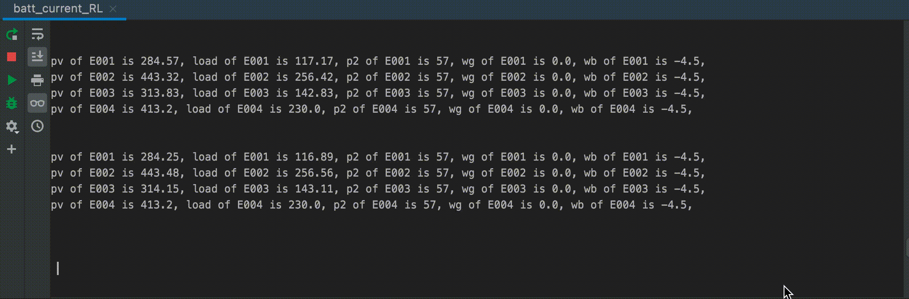

**apis-rl Specification Document**

# **Contents**
- [**Contents**](#contents)
- [**1. Terms and abbreviations**](#1-terms-and-abbreviations)
- [**2. Overview**](#2-overview)
- [**3. Functions**](#3-functions)
  - [**3.1. config**](#31-config)
  - [**3.2. global_var**](#32-global_var)
  - [**3.3. agent**](#33-agent)
  - [**3.4. RL_learn**](#34-rl_learn)
 

# **1. Terms and abbreviations**

| **Term**  | **Explanation**                                                                                 |
| --------- | ----------------------------------------------------------------------------------------------- |
| apis-rl   | Software for energy sharing with reinforcement learning methods                                 |
| EMU       | Energy Management Unit: A device for controlling a power storage system.                        |

 

# **2. Overview**

The Emulator runs a computer emulation that reproduces the hardware system for energy sharing, including the battery system and the DC/DC converter, etc. The Emulator reads in data on the amount of solar radiation and the power consumption of residences and emulates the flow of energy such as the power generated and consumed by multiple residences, and battery system charging and discharging. The emulation conditions can be changed in real time by using a Web browser to access and change the hardware parameters. There is also a function for communication with apis-main, which reads storage battery data from the hardware emulation on the computer and operates the DC/DC converter to emulate energy sharing.

# **3. Functions**
    
## **3.1. config**

## **3.2. global_var**
  
## **3.3. agent**

Figure 3-1

Figure 3-2
 
## **3.4. RL_learn**

